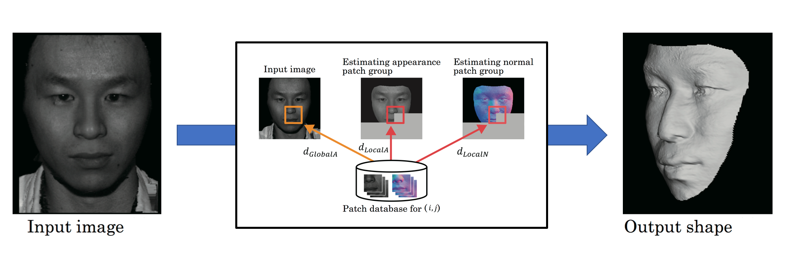

# Patch-Based 3D Face Reconstruction

This project is following a paper below.  

"3D Facial Geometry Reconstruction using Patch Database", SIGGRAPH Poster 2016  
[[Paper](http://delivery.acm.org/10.1145/2950000/2945102/a24-nozawa.pdf?ip=133.3.201.13&id=2945102&acc=ACTIVE%20SERVICE&key=D2341B890AD12BFE%2EE7C54C29BAE894E8%2E4D4702B0C3E38B35%2E4D4702B0C3E38B35&__acm__=1543305734_bba8c0d8e3fcca4cdadddb6d07e78b6d "Paper")]  




## Environment
Ubuntu 16.04  
Python2.7(Anaconda2-5.2.0)


## Dependency

+ OpenCV
+ Dlib
+ [shape_predictor_68_face_landmarks.dat](http://dlib.net/files/shape_predictor_68_face_landmarks.dat.bz2 "")


### Prerequisites

What things you need to install the software and how to install them

```
Give examples
```

### Installing

A step by step series of examples that tell you have to get a development env running

Say what the step will be

```
Give the example
```

And repeat

```
until finished
```

End with an example of getting some data out of the system or using it for a little demo

## Running the tests

Explain how to run the automated tests for this system

### Break down into end to end tests

Explain what these tests test and why

```
Give an example
```

### And coding style tests

Explain what these tests test and why

```
Give an example
```

## Deployment

Add additional notes about how to deploy this on a live system

## Built With

* [Dropwizard](http://www.dropwizard.io/1.0.2/docs/) - The web framework used
* [Maven](https://maven.apache.org/) - Dependency Management
* [ROME](https://rometools.github.io/rome/) - Used to generate RSS Feeds

## Contributing

Please read [CONTRIBUTING.md](https://gist.github.com/PurpleBooth/b24679402957c63ec426) for details on our code of conduct, and the process for submitting pull requests to us.

## Versioning

We use [SemVer](http://semver.org/) for versioning. For the versions available, see the [tags on this repository](https://github.com/your/project/tags). 

## Authors

* **Billie Thompson** - *Initial work* - [PurpleBooth](https://github.com/PurpleBooth)

See also the list of [contributors](https://github.com/your/project/contributors) who participated in this project.

## License

This project is licensed under the MIT License - see the [LICENSE.md](LICENSE.md) file for details

## Acknowledgments

* Hat tip to anyone who's code was used
* Inspiration
* etc

